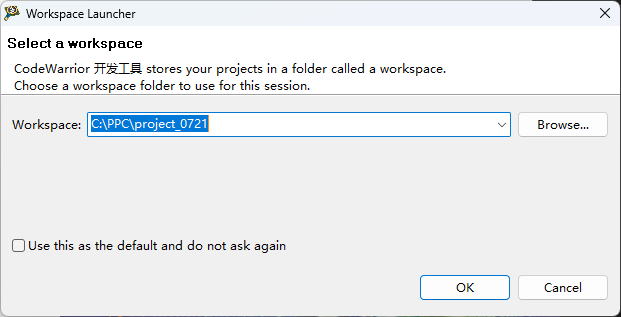
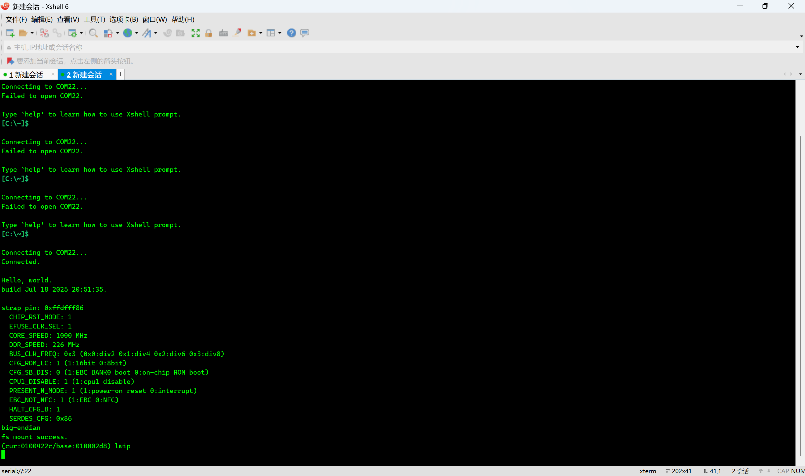
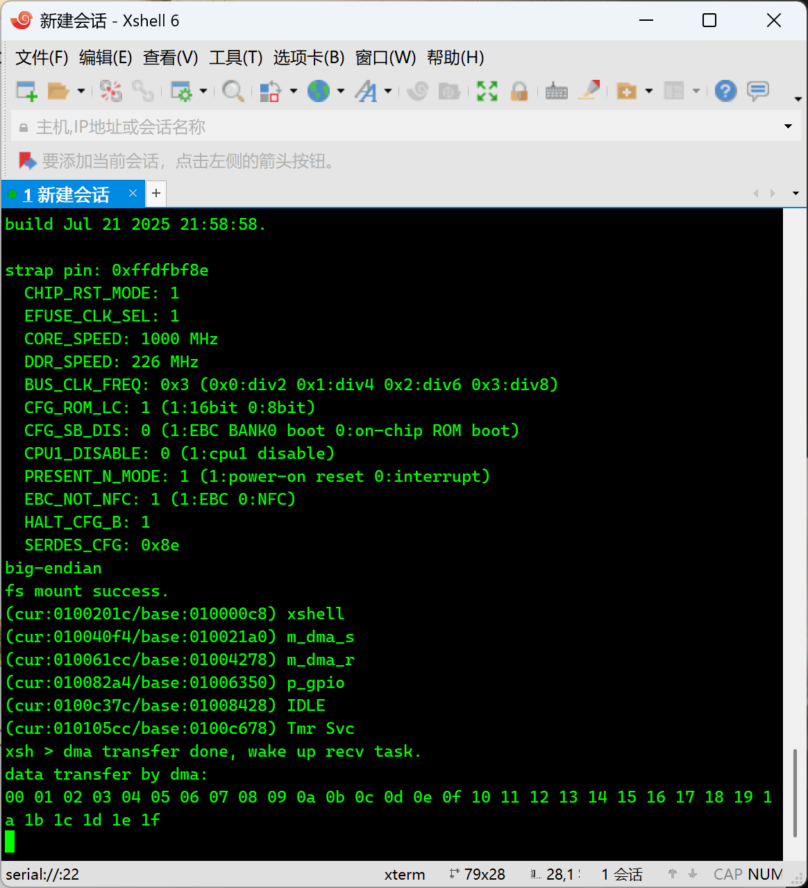

## 工程文件使用说明

### 1.CodeWorrior打开目录设置

打开CW时使用工作区为: X:/解压后文件位置/project_0721  

比如：  

  
### 2.检查路径配置

本工程均按照相对路径编写，因此如果出现文件找不到的情况请检查CW打开的工作区是否正确.  

### 3.phy出现问题导致lwip无法使用

进入程序，点击“编译程序B” -> “RunAs” -> “CodeWorrior 1”就可以下载到板子上，打开串口，由于phy的问题程序会卡在这个界面1约10s左右  

界面1:  

然后程序超时后进入xshell界面

xshell界面:  

按下回车可以进入xshell（没有截图）

按下tab可以查看xshell命令有哪些，输入phy x 0可以查看phy口寄存器的值（x为phy口号）

### 4.板子的跳线口

应该不用修改，观察输出应该为strap pin: 0xffdfbf8e.